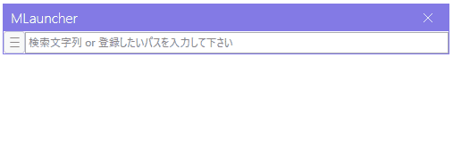

# MLauncherとは
ファイル/フォルダ/URLのランチャーです。パスを登録しておくと、検索でき、Enterで起動します(URLの場合はブラウザが起動します)

# 注意点
- 開発中の段階で、正式リリース前です。
- 追加したい機能/修正のリストは[MLauncherApp/TODO.md](MLauncherApp/TODO.md)を参照ください。

# 使い方
- 基本操作
    - Ctrl+Shift+Zキーで前面に表示
- ランチャーへの登録
	- 覚えておきたいファイルやフォルダをドラッグ&ドロップして登録する
	- もしくはパスを入力してEnterで登録する
	- URLも同様に登録可能
- 起動する
    - 半角英数字でパス名を検索可能
	- スペース区切りでAND検索も加納
	- Enterでそのファイルを起動
	- Ctrl+Enterで対象の親のディレクトリを起動

# 特徴
- 半角英数字での検索に対応しています(migemoによる)
- URLにもファイル/フォルダパスにも対応

# 利用しているOSS一覧
| 名称 | URL |
| --- | --- |
| migemo | https://github.com/koron/cmigemo |

# License
The source code is licensed MIT. The website content is licensed CC BY 4.0,see LICENSE.